# Premind — Purchase Order Approval System

A configurable approval engine where the workflow lives in **data, not in `if`-statements**. Built as a Laravel + MySQL backend, a React + TypeScript frontend, and a Docker Compose stack that runs both plus their dependencies on custom ports (28000/28443/25173/etc.) so it doesn't collide with anything else on your machine.

The design rule shaping the whole system: the workflow engine is generic and entity-agnostic. Any domain model that implements one interface (`Approvable`) can ride the same engine — purchase orders today, leave requests or expense claims tomorrow, with no engine changes.

## Stack at a Glance

The frontend talks to the backend over HTTPS through the host port mapping. The backend speaks to MySQL, Redis (cache + queue + JWT blacklist), and Mailpit (dev mailer) on the internal compose network. Service-to-service communication stays HTTP inside the network; HTTPS is host-facing only.

## Repository Layout

Each subfolder has its own README that goes deep on its concerns:

- **[backend/README.md](backend/README.md)** — engine architecture, domain separation, the three PDF scenarios as flowcharts, the database schema ERD, idempotency, the test breakdown, the deferred-items writeup (delegation, SLA, carry-forward, Camunda-style migration, etc.), and a one-page deployment draft.
- **[frontend/README.md](frontend/README.md)** — page graph, auth refresh sequence, folder structure, the idempotency hook, server-state strategy (TanStack Query keys + invalidation), trade-offs (no optimistic updates on approve/reject), and deferred items (workflow-builder UI, infinite inbox, HttpOnly refresh cookie).
- **[docker/README.md](docker/README.md)** — service map, port table, Make targets, HTTPS certs, volumes, production-stack notes.

## Quick Start

From the `docker/` folder, copy `.env.example` to `.env`, run `make up`, then `make migrate`. The first migrate also seeds (because `RUN_SEED=true` is on by default) — you'll see the demo credentials printed at the end. Visit the frontend at port 25173, sign in as Sara (`sara.manager@premind.local`, password `secret`), and her inbox will already have three demo POs covering all three branches of the seeded workflow (standard 2-step, parallel-approval, and full 3-step).

For deeper setup notes — HTTPS toggling, custom ports, alternate seeded users, Mailpit access, Make targets — see the docker README.

## What This Is

The original brief asked for a Purchase Order approval system where the approval flow is fully configurable at runtime: adding, removing, or reordering approval steps must not require touching code or redeploying. The whole repo is shaped around that principle.

The engine doesn't know what a Purchase Order is. It walks workflow steps from the database, evaluates each step's conditions against an `Approvable` subject, materializes the resolved approver set into the `approval_step_assignees` table, fires events as it moves through the lifecycle, and finalizes the process to approved / rejected / cancelled. Every event hits the audit log synchronously inside the engine transaction so the timeline is atomic with state.

The backend exposes the engine over a JWT-authenticated REST API with two-layer idempotency (middleware response cache + DB UNIQUE on action keys) so duplicate clicks and network retries can't double-apply approvals. The frontend layers a TypeScript-strict React app over the API: the inbox / detail / approve / reject flow on the request side, the create / edit / submit / resubmit / cancel flow on the requester side, an axios refresh-token interceptor that single-flights concurrent 401s, and a `useIdempotencyKey` hook that pairs with the backend's dedup.

## What's Shipped vs. Documented

This is summarized concisely below; each sub-README has the full breakdown.

**Shipped:**
- Generic, config-driven engine with strategy registries for conditions and approver resolvers
- Workflow versioning with version-pinning at process start (so config changes never disrupt in-flight processes)
- All four approval modes (single, parallel-any, parallel-all, quorum)
- Audit log of every engine event
- Two-layer idempotency
- Optimistic locking via `lock_version`
- Ad-hoc step injection and cancel-and-restart admin escape hatches
- Notifications (mail + database, queued, after-commit)
- 142 backend tests covering the engine, all three PDF scenarios end-to-end, notifications, and auth
- Full React UI: login, inbox, PO list/create/edit/detail, process detail with step + audit timelines, approve/reject with idempotency keys
- Docker stack with custom ports, HTTPS, supervisor-managed queue worker, Mailpit

**Documented (concept, why, how) but not built:**
- Workflow-builder UI (drag-and-drop)
- Delegation (approver-on-leave forwarding)
- SLA timers + escalation
- Carry-forward approvals on resubmit (Option C)
- Camunda-style process instance migration
- HttpOnly refresh-token cookie (security upgrade over localStorage)
- Component / hook frontend tests (infra in place, specs deferred)

## Pointers

- Original task brief: see external `TASK.pdf`.
- Sub-READMEs: [backend](backend/README.md), [frontend](frontend/README.md), [docker](docker/README.md).
