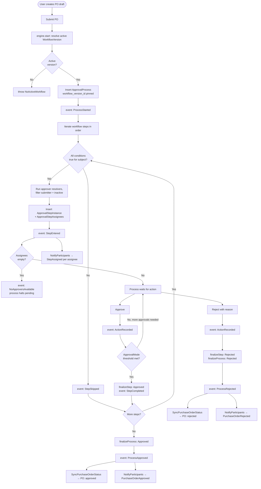
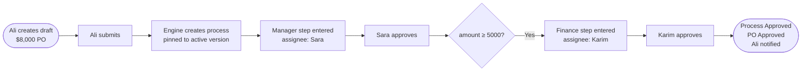
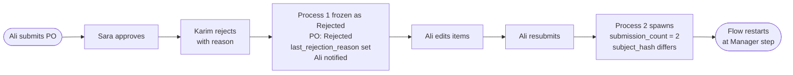
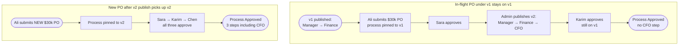

# Premind Backend — Purchase Order Approval Engine

A configurable approval engine where the workflow lives in **data, not in `if`-statements**. Laravel 11 + MySQL 8 + Redis. Drop-in usable for Purchase Orders today; reusable for any entity that implements one interface (`Approvable`).

## Quick Start

With Docker: from the `docker/` folder, copy `.env.example` to `.env`, run `make up`, then `make migrate`. The first migrate also seeds because `RUN_SEED=true` is on by default. The API is at port 28000, HTTPS at 28443, Mailpit at 28025, frontend dev server at 25173.

Without Docker: install Composer dependencies, copy `.env.example`, generate `APP_KEY` and `JWT_SECRET`, point DB/Redis at your services, run `migrate --seed`, run `serve`, and start a queue worker on the redis connection so notifications dispatch.

Run the suite with `php artisan test` — **140 passing tests in ~3 seconds**.

## Seeded Demo Credentials

Password is `secret` for everyone.

| Email                          | Role           | Notes                          |
| ------------------------------ | -------------- | ------------------------------ |
| admin@premind.local            | admin          |                                |
| sara.manager@premind.local     | manager        | direct manager of Ali, Omar    |
| karim.finance@premind.local    | finance_head   |                                |
| chen.cfo@premind.local         | cfo            |                                |
| ravi.cto@premind.local         | cto            |                                |
| ali.dev@premind.local          | requester      | reports to Sara, dept 3        |
| omar.it@premind.local          | requester      | reports to Sara, dept 3        |

The seeded workflow is two steps: `Manager Approval` (direct manager) → `Finance Head Approval` (role=finance_head, condition `amount ≥ 5000`). Two demo POs are pre-submitted on first seed so you can hit the inbox as Sara and approve immediately.

## Engine Lifecycle

Every event also fans out to `WriteAuditLog`, which writes to `approval_audit_log` synchronously inside the engine transaction.

## Scenario 1 — Standard $8,000 flow

## Scenario 2 — Rejection + edit + resubmit

## Scenario 3 — Configuration change

The invariant: `approval_processes.workflow_version_id` is set at `start()` and never mutated. Editing the workflow creates a new version; in-flight processes finish under their original version.

## Domain Separation

The codebase is split into two concerns under `app/Domains/`. **Workflow** is the generic engine — it has zero knowledge of Purchase Orders. **PurchaseOrder** is one consumer of that engine: its model implements `Approvable`, its listeners glue engine events to PO state and notifications. The arrow points one way. To host a new entity (LeaveRequest, ExpenseClaim), add a domain that implements `Approvable` and register a workflow with that subject_type — the engine itself stays untouched.

Engine internals: `Engine/` (WorkflowEngine, StepEvaluator), `Approvers/` and `Conditions/` (each a registry plus handler classes), `Contracts/` (the three interfaces), `Models/` (10 tables across definition, instance, and audit layers), `Events/` (10 named events), `Listeners/WriteAuditLog`. Conditions and approver resolvers are dispatched by string type through a registry — extension never requires editing engine code.

## How to Extend

Adding a new condition is one class implementing `ConditionHandler` plus one register-line in `WorkflowServiceProvider`. The new type is then usable as a string in `workflow_step_conditions.type` with whatever JSON config the handler needs.

Adding a new approver resolver follows the same shape against `ApproverResolver`.

Plugging the engine into a new entity is a model implementing `Approvable` (three small accessors), a morph-map registration, and a Workflow row keyed by that subject type. The engine starts processes, advances them, fires events identically — any cross-cutting domain logic (status sync, notifications) goes in a domain-local listener, never in the engine.

## API Surface

All under `/api/v1`. JWT bearer in the `Authorization` header. State-changing POSTs require an `Idempotency-Key` header (UUID).

| Group         | Endpoints                                                                                              |
| ------------- | ------------------------------------------------------------------------------------------------------ |
| Auth          | `POST /auth/login`, `POST /auth/refresh`, `POST /auth/logout`, `GET /auth/me`                          |
| Purchase Orders | `GET/POST /purchase-orders`, `GET/PATCH /purchase-orders/{id}`, `POST /purchase-orders/{id}/{submit\|resubmit\|cancel}` |
| Approvals     | `GET /approvals/inbox`, `GET /approvals/processes/{id}`, `POST /approvals/step-instances/{id}/{approve\|reject}` |
| Workflows (admin) | `GET/POST /workflows`, `GET /workflows/{id}`, `POST /workflows/{id}/versions`, `GET /workflow-versions/{id}`, `POST /workflow-versions/{id}/publish` |
| Admin escape hatches | `POST /admin/processes/{id}/inject-step`, `POST /admin/processes/{id}/cancel-and-restart` |

## Idempotency

Every state-changing POST requires `Idempotency-Key`. Two layers of dedup: a middleware response cache scoped per user (24h TTL) and a DB UNIQUE on `approval_actions.idempotency_key`. Replay of the same key with the same body returns the cached response; same key with a different body returns 409.

## Built vs. Deferred

| Item                                                  | Status        | Notes                                                                      |
| ----------------------------------------------------- | ------------- | -------------------------------------------------------------------------- |
| Generic config-driven engine                          | shipped       | Engine has zero PO knowledge                                               |
| Strategy registries (conditions + resolvers)          | shipped       | One class + one register-line to extend                                    |
| Workflow versioning + version pinning                 | shipped       | Scenario 3 invariant                                                       |
| Single / parallel-any / parallel-all / quorum modes   | shipped       | All four covered by tests                                                  |
| Submitter-cannot-self-approve, empty-assignee halt    | shipped       | Engine invariants                                                          |
| Audit log (10 event types, atomic)                    | shipped       | Sync inside engine txn                                                     |
| Idempotency middleware + DB UNIQUE                    | shipped       | Two-layer dedup                                                            |
| Optimistic locking via `lock_version`                 | shipped       | Bumped on finalize and cancel                                              |
| Ad-hoc step injection                                 | shipped (caveat) | See Known Issues                                                          |
| Cancel-and-restart                                    | shipped       | Admin endpoint                                                             |
| Notifications (mail + database, queued, after-commit) | shipped       | Three notification classes                                                 |
| 140-test suite                                        | shipped       | Engine, scenarios, notifications, auth                                     |
| Frontend                                              | not built     | Vite scaffold only                                                         |
| Workflow-builder UI                                   | deferred      | API supports it; UI deferred                                               |
| Delegation (approver-on-leave)                        | deferred      | Schema-ready: `approval_step_assignees.delegated_to_user_id`               |
| SLA timers + escalation                               | deferred      | Would need scheduled command + escalation events                           |
| Carry-forward approvals on resubmit                   | deferred      | `subject_hash` ships now to enable later                                   |
| Camunda-style process migration plans                 | deferred      | Intentionally cut — high cost for an edge case                             |
| Unique partial index on pending processes             | deferred      | Engine compensates with `lockForUpdate` + duplicate check                  |
| `.env.testing` for clean test env                     | deferred      | See Known Issues                                                           |

## Known Issues

1. **Ad-hoc step injection ordering bug.** When an ad-hoc step is injected mid-flight and the workflow's last regular step then approves, `WorkflowEngine::advanceFromStep` finalizes the process as Approved without checking for pending ad-hoc step instances; the ad-hoc step is orphaned. Fix: before `finalizeProcess`, also check for pending ad-hoc instances.
2. **`approval_processes` lacks a unique partial index** on `(subject_type, subject_id) WHERE status='pending'`. Engine compensates with `lockForUpdate`; DB-level guard is a small follow-up.
3. **`approval_step_instances` lacks a CHECK constraint** asserting one of `workflow_step_id IS NOT NULL` or all `ad_hoc_*` columns populated. Soft-enforced today via `isAdHoc()`.
4. **Test environment env-var leakage.** Laravel's Dotenv overrides phpunit.xml's `<env>` block; `CACHE_STORE`, `QUEUE_CONNECTION`, etc. resolve to redis in tests. Two test files work around it by overriding `cache.default` to `array` in setUp. Proper fix is a `.env.testing` file.
5. **`LoginTest::setUp` clears the wrong rate-limit key** (`login:127.0.0.1` ≠ Laravel's actual key format). Tests pass on a clean Redis but flake when state accumulates. Fixing item 4 makes this go away.

## Trade-offs

- **JWT (php-open-source-saver) over Sanctum SPA.** Stateless, explicit token lifecycle, custom `roles[]` claim avoids a `/me` round-trip on the frontend.
- **Linear paradigm with conditional steps, not graph/DAG.** Branching is "skip steps whose condition is false." If diamond branching that re-merges is ever required, this strains; nest workflows or migrate.
- **Audit log synchronous, atomic with engine txn.** Trade timeline freshness against eventual-consistency edge cases.
- **Notifications queued + after-commit.** External side effects shouldn't roll back approvals; each notification queues independently so SMTP outages don't fan out.
- **Resubmit semantics: fresh process (Option B).** Approvers re-click intentionally because the data changed; carry-forward (Option C) is documented but deferred.
- **Materialized assignees, not resolve-on-read.** Stable approver set, fast inbox query, no N+1; trade-off is that role mid-step changes don't retroactively grant access.
- **Strategy registry for conditions/resolvers, not Symfony ExpressionLanguage.** Sandboxing user-stored expression strings is a security review burden; admin-time validation can only check syntax, not semantics.

## Testing

| Layer                              | Tests | Covers                                                                       |
| ---------------------------------- | ----- | ---------------------------------------------------------------------------- |
| Unit — conditions + resolvers      | 53    | Every shipped handler, registry dispatch, unknown-type throws                |
| Unit — state machine + idempotency | 31    | Every legal/illegal PO transition, subject_hash determinism, middleware      |
| Feature — engine                   | 28    | Start, conditions, modes, versioning, ad-hoc, cancel — uses `TestApprovable` |
| Feature — scenarios                | 9     | The three PDF scenarios end-to-end via HTTP                                  |
| Feature — notifications            | 6     | Step-assigned, approval/rejection, ShouldQueueAfterCommit contract           |
| Feature — auth                     | 13    | Login, refresh, logout (blacklisted), me, throttling                         |
| **Total**                          | **140** | **~3 seconds**                                                             |

Engine tests run against `TestApprovable` (a dedicated test model), never `PurchaseOrder`. The polymorphism is proven by the test suite, not just claimed.

## Deployment Draft

For HA / multi-engineer setups, deploy on ECS Fargate or EKS with three task types from the same image: a **web** task running nginx + php-fpm behind an ALB, a **queue** task running `php artisan queue:work redis` with bounded `--max-jobs` and `--max-time` so memory leaks self-heal, and a **scheduler** task running `php artisan schedule:work`. Database is RDS MySQL 8 with daily snapshots and PITR. Cache, sessions, queue, and the JWT blacklist all live in ElastiCache Redis. Frontend builds to S3 + CloudFront. Secrets live in AWS Secrets Manager and inject at task launch. CI/CD via GitHub Actions: PR runs tests, build pushes to ECR, ECS rolling deploy gates on a one-shot migrate task. Observability: CloudWatch logs (structured JSON), Sentry for errors, queue-depth and request-latency metrics; the `/up` route is the load-balancer health probe.

For small-scale single-VPS, the same `docker-compose.yml` plus a `docker-compose.prod.yml` overlay works. Front it with an nginx reverse proxy and a Let's Encrypt sidecar. Daily DB backup via cron to S3. Logs via tail or Loki/Promtail.

Pre-launch: `APP_ENV=production`, `APP_DEBUG=false`, real `APP_KEY` and `JWT_SECRET` from secrets manager, CORS locked to the actual frontend origin, `config:cache && route:cache && view:cache` baked into the entrypoint, mail driver swapped from Mailpit to SES or Mailgun.

## Pointers

Original task brief: see external `TASK.pdf`.
