# Premind Backend — Purchase Order Approval Engine

A configurable approval engine where the workflow lives in **data, not in `if`-statements**. Laravel 11 + MySQL 8 + Redis. Drop-in usable for Purchase Orders today; reusable for any entity that implements one interface (`Approvable`).

## Quick Start

With Docker: from the `docker/` folder, copy `.env.example` to `.env`, run `make up`, then `make migrate`. The first migrate also seeds because `RUN_SEED=true` is on by default. The API is at port 28000, HTTPS at 28443, Mailpit at 28025, frontend dev server at 25173.

Without Docker: install Composer dependencies, copy `.env.example`, generate `APP_KEY` and `JWT_SECRET`, point DB/Redis at your services, run `migrate --seed`, run `serve`, and start a queue worker on the redis connection so notifications dispatch.

Run the suite with `php artisan test` — **140 passing tests in ~3 seconds**.

## Seeded Demo Credentials

Password is `secret` for everyone.

| Email                          | Role           | Notes                          |
| ------------------------------ | -------------- | ------------------------------ |
| admin@premind.local            | admin          |                                |
| sara.manager@premind.local     | manager        | direct manager of Ali, Omar    |
| karim.finance@premind.local    | finance_head   |                                |
| chen.cfo@premind.local         | cfo            |                                |
| ravi.cto@premind.local         | cto            |                                |
| ali.dev@premind.local          | requester      | reports to Sara, dept 3        |
| omar.it@premind.local          | requester      | reports to Sara, dept 3        |

The seeded workflow is three steps:

1. **Manager Approval** — single approver, direct manager of the requester. Always runs.
2. **Procurement Review** — `parallel_any` mode, two approvers (CTO and CFO), either one is enough. Runs only when `category = IT`.
3. **Finance Head Approval** — single approver, role `finance_head`. Runs only when `amount ≥ 5000`.

Three demo POs are pre-submitted so the inbox demonstrates each branch:

| Demo PO                    | Category   | Amount  | Steps it traverses                                  |
| -------------------------- | ---------- | ------- | --------------------------------------------------- |
| Office Renovation          | Operations | $8,000  | Manager → Finance Head                              |
| Office Printer             | IT         | $1,500  | Manager → Procurement (parallel CTO/CFO)            |
| 2× MacBook Pro 16"         | IT         | $8,000  | Manager → Procurement (parallel CTO/CFO) → Finance  |

Login as Sara to clear the manager step on all three; then login as Ravi (CTO) **or** Chen (CFO) — whichever clicks first wins the parallel step — and Karim for the Finance step.

### Seeded Workflow at a Glance

## Engine Lifecycle

Every event also fans out to `WriteAuditLog`, which writes to `approval_audit_log` synchronously inside the engine transaction.

## Scenario 1 — Standard $8,000 flow

## Scenario 2 — Rejection + edit + resubmit

## Scenario 3 — Configuration change

The invariant: `approval_processes.workflow_version_id` is set at `start()` and never mutated. Editing the workflow creates a new version; in-flight processes finish under their original version.

## Purchase Order State Machine

`Draft` and `Rejected` are editable. `Submitted` is **never** editable — protects approvers from facts changing under them. `Approved` and `Cancelled` are terminal.

## Domain Separation

The codebase is split into two concerns under `app/Domains/`. **Workflow** is the generic engine — it has zero knowledge of Purchase Orders. **PurchaseOrder** is one consumer of that engine: its model implements `Approvable`, its listeners glue engine events to PO state and notifications. The arrow points one way. To host a new entity (LeaveRequest, ExpenseClaim), add a domain that implements `Approvable` and register a workflow with that subject_type — the engine itself stays untouched.

Engine internals: `Engine/` (WorkflowEngine, StepEvaluator), `Approvers/` and `Conditions/` (each a registry plus handler classes), `Contracts/` (the three interfaces), `Models/` (10 tables across definition, instance, and audit layers), `Events/` (10 named events), `Listeners/WriteAuditLog`. Conditions and approver resolvers are dispatched by string type through a registry — extension never requires editing engine code.

### Database Schema

Three layers: **definition** (workflows / versions / steps / conditions / approvers — config that admins author), **instance** (processes / step_instances / assignees / actions — runtime state per approval), **audit** (audit_log — append-only event stream). The split lets the same workflow definition serve unlimited instances without coupling.

## How to Extend

Adding a new condition is one class implementing `ConditionHandler` plus one register-line in `WorkflowServiceProvider`. The new type is then usable as a string in `workflow_step_conditions.type` with whatever JSON config the handler needs.

Adding a new approver resolver follows the same shape against `ApproverResolver`.

Plugging the engine into a new entity is a model implementing `Approvable` (three small accessors), a morph-map registration, and a Workflow row keyed by that subject type. The engine starts processes, advances them, fires events identically — any cross-cutting domain logic (status sync, notifications) goes in a domain-local listener, never in the engine.

## API Surface

All under `/api/v1`. JWT bearer in the `Authorization` header. State-changing POSTs require an `Idempotency-Key` header (UUID).

| Group         | Endpoints                                                                                              |
| ------------- | ------------------------------------------------------------------------------------------------------ |
| Auth          | `POST /auth/login`, `POST /auth/refresh`, `POST /auth/logout`, `GET /auth/me`                          |
| Purchase Orders | `GET/POST /purchase-orders`, `GET/PATCH /purchase-orders/{id}`, `POST /purchase-orders/{id}/{submit\|resubmit\|cancel}` |
| Approvals     | `GET /approvals/inbox`, `GET /approvals/processes/{id}`, `POST /approvals/step-instances/{id}/{approve\|reject}` |
| Workflows (admin) | `GET/POST /workflows`, `GET /workflows/{id}`, `POST /workflows/{id}/versions`, `GET /workflow-versions/{id}`, `POST /workflow-versions/{id}/publish` |
| Admin escape hatches | `POST /admin/processes/{id}/inject-step`, `POST /admin/processes/{id}/cancel-and-restart` |

## Idempotency

Every state-changing POST requires `Idempotency-Key`. Two layers of dedup: a middleware response cache scoped per user (24h TTL) and a DB UNIQUE on `approval_actions.idempotency_key`. Replay of the same key with the same body returns the cached response; same key with a different body returns 409.

## Built vs. Deferred

| Item                                                  | Status        | Notes                                                                      |
| ----------------------------------------------------- | ------------- | -------------------------------------------------------------------------- |
| Generic config-driven engine                          | shipped       | Engine has zero PO knowledge                                               |
| Strategy registries (conditions + resolvers)          | shipped       | One class + one register-line to extend                                    |
| Workflow versioning + version pinning                 | shipped       | Scenario 3 invariant                                                       |
| Single / parallel-any / parallel-all / quorum modes   | shipped       | All four covered by tests                                                  |
| Submitter-cannot-self-approve, empty-assignee halt    | shipped       | Engine invariants                                                          |
| Audit log (10 event types, atomic)                    | shipped       | Sync inside engine txn                                                     |
| Idempotency middleware + DB UNIQUE                    | shipped       | Two-layer dedup                                                            |
| Optimistic locking via `lock_version`                 | shipped       | Bumped on finalize and cancel                                              |
| Ad-hoc step injection                                 | shipped (caveat) | See Known Issues                                                          |
| Cancel-and-restart                                    | shipped       | Admin endpoint                                                             |
| Notifications (mail + database, queued, after-commit) | shipped       | Three notification classes                                                 |
| 140-test suite                                        | shipped       | Engine, scenarios, notifications, auth                                     |
| Frontend                                              | not built     | Vite scaffold only                                                         |
| Workflow-builder UI                                   | deferred      | API supports it; UI deferred                                               |
| Delegation (approver-on-leave)                        | deferred      | Schema-ready: `approval_step_assignees.delegated_to_user_id`               |
| SLA timers + escalation                               | deferred      | Would need scheduled command + escalation events                           |
| Carry-forward approvals on resubmit                   | deferred      | `subject_hash` ships now to enable later                                   |
| Camunda-style process migration plans                 | deferred      | Intentionally cut — high cost for an edge case                             |
| Unique partial index on pending processes             | deferred      | Engine compensates with `lockForUpdate` + duplicate check                  |
| `.env.testing` for clean test env                     | deferred      | See Known Issues                                                           |

## Deferred — Concept, Why, How

The PDF asks that anything cut for time be described well enough that the thinking is visible. Each subsection below is the *concept*, the *why*, and the *sketch* of how it would land — written so a colleague could pick any one of them up.

### Frontend

**Concept.** The React app the PDF describes: login, PO create form, inbox view, detail view with timeline, approve/reject with comment.

**Why.** Backend is half the deliverable. Without the frontend, a reviewer cannot walk the seeded scenarios in a browser, and the React-craft evaluation criterion is unassessable. Even a thin slice closes the deliverable.

**How.** Vite + React + TypeScript strict mode. TanStack Query v5 for server state with hierarchical keys (`['inbox']`, `['process', id]`, `['purchase-order', id]`). React Hook Form + Zod for forms, the Zod schemas mirroring the Laravel Form Request rules. Axios with a refresh-token interceptor that single-flights concurrent 401s. Tailwind + shadcn for components. A small idempotency-key hook generates a UUID per click and rotates only on success — transient errors retry with the same key, so the backend dedup layers actually pay off. Folder structure mirrors the backend's domain split (`features/auth`, `features/purchase-orders`, `features/approvals`, `features/workflows`). The existing API Resources are exactly the JSON shape the UI consumes — no transformation layer.

### Workflow-builder UI

**Concept.** An admin UI to author workflows visually — drag steps to reorder, configure conditions and approvers from typed dropdowns, save as a draft version, publish. No code, no seed edits, no deploys.

**Why.** Engineers should not be the bottleneck for changing approval rules. Operations and product owners want to add a CFO step, swap a department's approver, or change a threshold without filing a ticket. The whole point of "the process lives in data" is undermined if editing that data still requires SQL or PHP.

**How.** A React page that mirrors the API the backend already exposes (`POST /workflows/{id}/versions` with a steps array). Two new registry-introspection endpoints (`GET /workflow/condition-types` and `GET /workflow/resolver-types`) would return the registered types and their `configSchema()`; the UI uses those to render dynamic per-step forms, so adding a new condition handler in PHP automatically lights up a new option in the UI. Drag-and-drop via dnd-kit. Editing a published version is blocked client- and server-side (already enforced by `WorkflowVersionPolicy`); to revise, you clone-to-draft. The visual editor never bypasses the API — saving a workflow is just a POST.

### Delegation (approver-on-leave)

**Concept.** An approver going on leave configures a substitute for a date range. Pending and incoming approvals route to the substitute; the audit log shows "approved on behalf of X."

**Why.** Real organizations have vacations. Without first-class delegation, processes stall on individual humans, and ops fakes it with admin impersonation or ad-hoc step injection — both lossy and audit-poor. Delegation also handles the "manager left the company" case more gracefully than re-running resolvers from scratch.

**How.** A new `delegations` table with `(from_user_id, to_user_id, valid_from, valid_until, reason)` and a small CRUD endpoint scoped to the delegating user. At step entry, after `StepEvaluator` resolves assignees, a final pass checks delegation: for each resolved user with an active delegation in window, write `approval_step_assignees.delegated_to_user_id` — the column already exists, schema-ready. The engine's authorization in `submitAction` already accepts either `user_id` or `delegated_to_user_id`, so no engine change is needed. Audit records the substitute as the actor with a "via delegation" payload field. Optional polish: a `DelegatingResolver` decorator that wraps any other resolver, so per-step opt-in becomes possible.

### SLA timers + escalation

**Concept.** Each step can carry an SLA (e.g., 24 hours). If the assignee doesn't act in time, the step escalates per a policy: notify the assignee's manager, add the manager as an additional approver, or auto-skip with audit.

**Why.** Approvals stall. Without SLAs, a PO can sit in someone's inbox for weeks. SLAs create gentle accountability and keep velocity visible to leadership. Escalation policies are often the actual business value — "if Finance doesn't act in 48h, the CFO sees it" is what stakeholders ask for, not just "send another reminder."

**How.** Add `sla_hours` and `escalation_policy` columns to `workflow_steps`. A scheduled command (`ProcessSlaBreaches`) runs every five minutes, finds step instances where `started_at + sla_hours < now()` and `escalated_at IS NULL`, and applies the policy: `notify_manager` fires a `StepSlaBreached` event whose listener notifies; `add_manager_approver` inserts a new assignee row; `auto_skip` finalizes the step. Each path writes an audit entry. The engine's hot path never changes — escalation is purely additive and runs on a cron, never blocking a request.

### Carry-forward approvals on resubmit (Option C)

**Concept.** When a rejected PO is edited and resubmitted, approvers who already approved a step on bit-identical content are auto-approved on the new process; only changed-content steps need fresh review.

**Why.** Today (Option B), every approver re-clicks even for tiny edits — friction that degrades trust in the process for high-frequency revisions. Option B was chosen as the safer default because "approvers' prior consent doesn't survive PO edits." Option C says: if the data the approver saw is bit-identical, that consent is still informed.

**How.** The `subject_hash` column is a SHA-256 of the PO content recomputed at every submission and already shipped — that's the enabling primitive. On resubmit, before each step's resolver runs, query past actions: for every `(workflow_step_id, user_id)` pair from prior processes on the same subject where the historical `subject_hash` matches the current one, auto-record a fresh action with `carried_forward_from_action_id` set. Audit shows "carried forward from process #N." Approvers can opt out by configuring `force_re_approve = true` per step. Implementation is one new method on the engine and one column on `approval_actions`.

### Camunda-style process instance migration

**Concept.** When admins need to migrate in-flight processes to a new workflow version (rare, usually regulatory), define a migration plan that maps v1 steps to v2 steps and apply it.

**Why.** Default versioning — in-flight processes stay on their pinned version — is correct 95% of the time. The 5% is compliance changes that must apply retroactively, or a buggy v1 that needs a v2 fix mid-flight. Doing it ad-hoc by cancel-and-restart loses partial progress and makes audit messy.

**How.** A `WorkflowMigrationPlan` model with `(from_version_id, to_version_id, step_mappings JSON)`. An `ApplyMigrationPlan` job iterates active processes on `from_version_id`; for each, it finds the current step's mapping in v2, updates `current_step_instance_id` to a new instance under v2, and copies completed actions where step IDs map. Audit records a `migration_applied` event with the plan ID and the old-to-new step mapping. Intentionally cut at this scope — Camunda took years to get this right; doing it in a week is a footgun. The point of the writeup is to signal that the system is aware of this gap, not to ship a half-built version.

### `.env.testing` for clean test environment

**Concept.** A dedicated env file Laravel auto-loads when `APP_ENV=testing`, overriding the dev `.env`'s redis/mysql settings with array/sqlite drivers for tests.

**Why.** Two test files currently override `cache.default` to `array` in setUp because Laravel's Dotenv overrides phpunit.xml's `<env>` block. Tests pass on a clean Redis but flake when state accumulates between runs (the `LoginTest` rate-limit symptom is one downstream effect). `.env.testing` is the canonical Laravel solution and removes the workarounds.

**How.** Create `backend/.env.testing` with `CACHE_STORE=array`, `QUEUE_CONNECTION=sync`, `SESSION_DRIVER=array`, and either `DB_CONNECTION=sqlite` plus `DB_DATABASE=:memory:` (faster) or keep MySQL (closer to prod). Drop the per-test `cache.default` overrides. The `LoginTest` flakiness resolves automatically because no Redis is touched in tests.

### Database invariants — partial unique index + CHECK constraint

**Concept.** Defense-in-depth at the database level for two engine invariants — at most one pending process per subject, and step instances are either workflow-bound or fully ad-hoc.

**Why.** The engine enforces these in code (`lockForUpdate` + duplicate check; `isAdHoc()` accessor). DB-level enforcement catches future code paths that bypass the engine — direct SQL, a careless seeder, or a new admin endpoint that forgets to call the right helper. Cheap insurance against a class of bugs.

**How.** For the partial unique index on `approval_processes`: MySQL 8 doesn't support partial indexes directly, but a virtual generated column (`pending_subject_key = IF(status='pending', CONCAT(subject_type, ':', subject_id), NULL)`) plus a UNIQUE index on it does the job, since NULLs are allowed multiply and only pending rows materialize. Postgres alternative is `CREATE UNIQUE INDEX ... WHERE status='pending'` natively. For the CHECK on `approval_step_instances`: a CHECK clause `(workflow_step_id IS NOT NULL OR ad_hoc_resolver_type IS NOT NULL)` covers the invariant.

## Known Issues

1. **Ad-hoc step injection ordering bug.** When an ad-hoc step is injected mid-flight and the workflow's last regular step then approves, `WorkflowEngine::advanceFromStep` finalizes the process as Approved without checking for pending ad-hoc step instances; the ad-hoc step is orphaned. Fix: before `finalizeProcess`, also check for pending ad-hoc instances.
2. **`approval_processes` lacks a unique partial index** on `(subject_type, subject_id) WHERE status='pending'`. Engine compensates with `lockForUpdate`; DB-level guard is a small follow-up.
3. **`approval_step_instances` lacks a CHECK constraint** asserting one of `workflow_step_id IS NOT NULL` or all `ad_hoc_*` columns populated. Soft-enforced today via `isAdHoc()`.
4. **Test environment env-var leakage.** Laravel's Dotenv overrides phpunit.xml's `<env>` block; `CACHE_STORE`, `QUEUE_CONNECTION`, etc. resolve to redis in tests. Two test files work around it by overriding `cache.default` to `array` in setUp. Proper fix is a `.env.testing` file.
5. **`LoginTest::setUp` clears the wrong rate-limit key** (`login:127.0.0.1` ≠ Laravel's actual key format). Tests pass on a clean Redis but flake when state accumulates. Fixing item 4 makes this go away.

## Trade-offs

- **JWT (php-open-source-saver) over Sanctum SPA.** Stateless, explicit token lifecycle, custom `roles[]` claim avoids a `/me` round-trip on the frontend.
- **Linear paradigm with conditional steps, not graph/DAG.** Branching is "skip steps whose condition is false." If diamond branching that re-merges is ever required, this strains; nest workflows or migrate.
- **Audit log synchronous, atomic with engine txn.** Trade timeline freshness against eventual-consistency edge cases.
- **Notifications queued + after-commit.** External side effects shouldn't roll back approvals; each notification queues independently so SMTP outages don't fan out.
- **Resubmit semantics: fresh process (Option B).** Approvers re-click intentionally because the data changed; carry-forward (Option C) is documented but deferred.
- **Materialized assignees, not resolve-on-read.** Stable approver set, fast inbox query, no N+1; trade-off is that role mid-step changes don't retroactively grant access.
- **Strategy registry for conditions/resolvers, not Symfony ExpressionLanguage.** Sandboxing user-stored expression strings is a security review burden; admin-time validation can only check syntax, not semantics.

## Testing

| Layer                              | Tests | Covers                                                                       |
| ---------------------------------- | ----- | ---------------------------------------------------------------------------- |
| Unit — conditions + resolvers      | 53    | Every shipped handler, registry dispatch, unknown-type throws                |
| Unit — state machine + idempotency | 31    | Every legal/illegal PO transition, subject_hash determinism, middleware      |
| Feature — engine                   | 28    | Start, conditions, modes, versioning, ad-hoc, cancel — uses `TestApprovable` |
| Feature — scenarios                | 9     | The three PDF scenarios end-to-end via HTTP                                  |
| Feature — notifications            | 6     | Step-assigned, approval/rejection, ShouldQueueAfterCommit contract           |
| Feature — auth                     | 13    | Login, refresh, logout (blacklisted), me, throttling                         |
| **Total**                          | **140** | **~3 seconds**                                                             |

Engine tests run against `TestApprovable` (a dedicated test model), never `PurchaseOrder`. The polymorphism is proven by the test suite, not just claimed.

## Deployment Draft

For HA / multi-engineer setups, deploy on ECS Fargate or EKS with three task types from the same image: a **web** task running nginx + php-fpm behind an ALB, a **queue** task running `php artisan queue:work redis` with bounded `--max-jobs` and `--max-time` so memory leaks self-heal, and a **scheduler** task running `php artisan schedule:work`. Database is RDS MySQL 8 with daily snapshots and PITR. Cache, sessions, queue, and the JWT blacklist all live in ElastiCache Redis. Frontend builds to S3 + CloudFront. Secrets live in AWS Secrets Manager and inject at task launch. CI/CD via GitHub Actions: PR runs tests, build pushes to ECR, ECS rolling deploy gates on a one-shot migrate task. Observability: CloudWatch logs (structured JSON), Sentry for errors, queue-depth and request-latency metrics; the `/up` route is the load-balancer health probe.

For small-scale single-VPS, the same `docker-compose.yml` plus a `docker-compose.prod.yml` overlay works. Front it with an nginx reverse proxy and a Let's Encrypt sidecar. Daily DB backup via cron to S3. Logs via tail or Loki/Promtail.

Pre-launch: `APP_ENV=production`, `APP_DEBUG=false`, real `APP_KEY` and `JWT_SECRET` from secrets manager, CORS locked to the actual frontend origin, `config:cache && route:cache && view:cache` baked into the entrypoint, mail driver swapped from Mailpit to SES or Mailgun.

## Pointers

Original task brief: see external `TASK.pdf`.
