# Premind Docker Stack

Five-container Compose setup for local development. All services use the `2xxxx` port prefix on the host so they don't collide with any defaults you might have running.

## Services

| Service       | Image                | Internal | Host port (default)        | What it does                                                  |
| ------------- | -------------------- | -------- | -------------------------- | ------------------------------------------------------------- |
| `app`         | custom (php:8.4-fpm) | 80, 443  | **28000** (HTTP), **28443** (HTTPS) | Laravel + nginx + supervisor (php-fpm, nginx, queue, scheduler) |
| `mysql`       | `mysql:8`            | 3306     | **23306**                  | Primary database, healthchecked                               |
| `redis`       | `redis:7-alpine`     | 6379     | **26379**                  | Cache, sessions, queue, JWT blacklist                         |
| `frontend`    | custom (node:20)     | 5173     | **25173**                  | Vite dev server with HMR, HTTPS toggleable                    |
| `mailpit`     | `axllent/mailpit`    | 8025, 1025 | **28025** (UI), **21025** (SMTP) | Captures dev emails so notifications are visible            |

The `app` container runs four processes under supervisor (php-fpm, nginx, `queue:work redis`, `schedule:work`). For production this would split into separate web / queue / scheduler tasks; the single-container layout is a deliberate dev-time convenience.

## Make Targets

The `Makefile` wraps the common Compose calls. Run `make help` to see them. The most useful ones:

- `up` / `down` — bring the stack up or down
- `build` / `rebuild` — build images (the second one ignores the cache)
- `logs` — tail logs from all services
- `shell` — drop into bash inside the `app` container
- `tinker` — open a Laravel REPL
- `migrate` / `fresh` / `seed` — database lifecycle (`fresh` drops everything and reseeds)
- `test` — run the backend test suite inside the `app` container
- `typecheck` / `lint` — frontend checks inside the `frontend` container
- `certs` — generate self-signed HTTPS certs for `localhost` + `127.0.0.1`
- `clean` — `down -v`, destructive, drops MySQL and Redis data

## Environment

Copy `.env.example` to `.env` to customize. Every port is overridable; the defaults are baked into the example so unmodified setup just works. `DOCKER_UID` / `DOCKER_GID` should match your host user so bind-mounted directories (`storage/`, `bootstrap/cache/`, `node_modules/`) don't end up root-owned. `RUN_SEED=true` runs seeders on first boot. `VITE_HTTPS=true` serves the Vite dev server over HTTPS using certs from `docker/certs/`.

For per-developer customizations (alternate ports, debug settings, additional tools), copy `docker-compose.override.yml.example` to `docker-compose.override.yml`. The override file is gitignored.

## HTTPS

Run `make certs` once. The script generates a self-signed RSA cert covering `CN=localhost` and `subjectAltName=DNS:localhost,IP:127.0.0.1`, writes it to `docker/certs/`, and the certs are bind-mounted read-only into both the `app` (nginx) and `frontend` (Vite) containers. The browser will show "untrusted issuer" — accept once.

For a browser-trusted cert without warnings, install [mkcert](https://github.com/FiloSottile/mkcert) on the host, run `mkcert -install`, then regenerate the certs into the same paths. Inter-container communication stays plain HTTP — HTTPS is host-facing only, the standard pattern.

## Volumes

- `mysql_data` — MySQL data files (cleared by `make clean`)
- `redis_data` — Redis dump (cleared by `make clean`)
- `composer_cache` — speeds up rebuilds
- `frontend_node_modules` — keeps the container's Linux `node_modules` separate from the host's, since they're compiled for different OS targets

The `backend/` and `frontend/` source directories are bind-mounted into their containers for hot reload. The `certs/` folder is bind-mounted read-only.

## Boot Sequence

The `app` container's entrypoint:

1. Waits for MySQL via `mysqladmin ping` (60s timeout)
2. Waits for Redis via `redis-cli ping`
3. Fixes ownership on `storage/` and `bootstrap/cache/` to `www-data`
4. Generates `APP_KEY` if empty
5. Generates `JWT_SECRET` if empty
6. Runs `php artisan migrate --force` (gated by a lock file so it doesn't re-run on every restart)
7. If `RUN_SEED=true`, runs seeders
8. In production, runs `config:cache && route:cache && view:cache`
9. Hands off to supervisord with proper signal forwarding

Compose's `service_healthy` dependency ordering ensures `app` doesn't try to migrate before MySQL is ready.

## Production Stack

This compose file is dev-shaped. For production:

- Split the `app` container into separate **web**, **queue**, and **scheduler** tasks from the same image (different commands, different scaling rules)
- Replace MySQL/Redis containers with managed services (RDS, ElastiCache)
- Replace the Vite dev server with a static build (`pnpm build`) hosted on S3 + CloudFront with the API hostname baked in at build
- Replace Mailpit with a real mail provider (SES, Mailgun)
- Move secrets into a secrets manager (AWS Secrets Manager / Vault)
- Add a production overlay (`docker-compose.prod.yml`) for the single-VPS deployment path described in the backend README

Both deployment paths — cloud-native and single-VPS — are sketched in the backend README's Deployment Draft section.

## Pointers

- Application overview: [../README.md](../README.md)
- Backend deep dive: [../backend/README.md](../backend/README.md)
- Frontend deep dive: [../frontend/README.md](../frontend/README.md)
