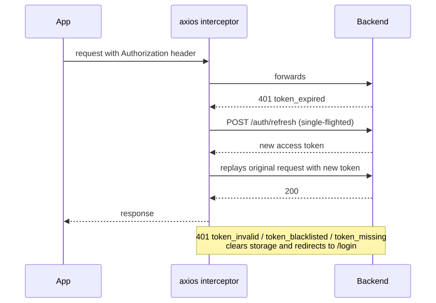

# Premind Frontend — Purchase Order Approvals UI

The React client for the Premind approval engine. Vite + TypeScript strict + TanStack Query + React Hook Form + Zod + Tailwind. Pairs with the backend in the sibling `backend/` folder.

## Quick Start

With Docker: from the `docker/` folder, copy `.env.example` to `.env` and bring up the stack. The frontend dev server is exposed on port 25173 and points at the HTTPS API on 28443. Sign in with any seeded user (password is `secret`).

Without Docker: install dependencies with pnpm, copy `.env.example` to `.env`, set `VITE_API_URL` to your running backend, and start the dev server. The build command produces a static bundle ready to host behind a CDN.

The TypeScript build, lint, and tests are wired into the standard pnpm scripts: `dev`, `build`, `typecheck`, `lint`, `test`.

## Demo Flow

Sign in as Sara (sara.manager@premind.local) — the seeded data places three POs on her inbox, one per branch of the seeded workflow. Approve each step and watch the timeline advance; for the IT POs, the second step is a parallel-any step where either the CTO (Ravi) or the CFO (Chen) can approve. Reject one as Karim with a reason and the requester (Ali) sees the rejection banner on the PO detail page; he can edit and resubmit, which spawns a fresh process while the rejected one stays frozen as audit.

## Page Graph

Two route guards drive the auth boundary: `<RequireAuth>` redirects to `/login` while preserving the intended location, and `<RequireAdmin>` further gates `/admin/workflows` and bounces non-admins back to the inbox. All authenticated routes nest under `<AppLayout>`, which provides the top nav, current-user badge, and sign-out.

## Auth Refresh Flow

The refresh promise is module-scoped, so concurrent 401s wait on a single in-flight refresh rather than each kicking off its own. On success, every queued request retries with the new token. On refresh failure, all in-flight requests reject and the user is redirected to the login page. This is opaque to features — they call the axios client and the interceptor handles everything.

## Idempotency Hook

Every state-changing call to the backend (submit, resubmit, cancel, approve, reject) requires an `Idempotency-Key` header. The `useIdempotencyKey()` hook returns a `{ key, rotate }` pair; the key is a UUID generated once when the hook mounts. On a successful mutation, the page calls `rotate()` to mint a fresh key for the next click. On a transient error (network blip, 500), the page retries with the **same** key — the backend dedupes via its middleware cache and the DB UNIQUE on `approval_actions.idempotency_key`, so duplicate submissions don't double-apply. Each mutation site holds its own hook instance so submit / cancel / approve / reject have independent keys.

## Server State

TanStack Query owns server-state with hierarchical query keys: `['inbox']`, `['process', id]`, `['purchase-order', id]`, `['purchase-orders']`. Stale time is 30 seconds by default; `refetchOnWindowFocus` is enabled so coming back to the tab refreshes the inbox without manual reloads. Mutations explicitly invalidate the relevant keys on success — approving a step invalidates `['process', id]`, `['inbox']`, `['purchase-order', subjectId]`, and `['purchase-orders']` so every view that mentioned that PO updates atomically.

Optimistic updates are deliberately **off** for approve and reject. Approval is a high-stakes action; the server is the source of truth, and rendering "Approved" before the backend confirms is the wrong UX. Spinners over speed.

## Folder Structure

The arrow points one way: `app/` composes pages from `features/`, and `features/` siblings consume `shared/` but never each other. Cross-feature reuse goes through `shared/`. Same one-way-arrow discipline as the backend.

## How to Extend

To add a new entity (say, leave requests): add a `features/leave-requests/` folder mirroring the purchase-orders structure (api, schemas, types, list/detail pages). Reuse `shared/api/client.ts` for HTTP, `useIdempotencyKey` for mutations, and the existing UI primitives. Add the routes under `<RequireAuth>` in `app/routes.tsx`. The approvals feature already handles any subject type via the inbox — if the new entity exposes the right shape on `inbox.subject`, it shows up automatically.

To add a new condition or resolver type to the backend: nothing changes here as long as you ship the backend's registry-introspection endpoints (sketched in the backend deferred section) — the workflow-builder UI would auto-populate dropdowns from them. Until then, workflows are admin-API-driven and the seeded data covers the demo.

## Built vs. Deferred

| Item                                                    | Status     | Notes                                                                   |
| ------------------------------------------------------- | ---------- | ----------------------------------------------------------------------- |
| Login + JWT lifecycle (refresh interceptor, storage)    | shipped    | Single-flight refresh, role claim used by guards                        |
| Route guards (RequireAuth, RequireAdmin)                | shipped    | Preserves return location after login                                   |
| App shell with role-aware nav + sign-out                | shipped    | Admin link shows only for admins                                        |
| Purchase Order list                                     | shipped    | Owner sees own; admin sees all (backend does the filter)                |
| Purchase Order create with dynamic line items           | shipped    | useFieldArray, live total, RHF + Zod                                    |
| Purchase Order edit                                     | shipped    | Guarded by `isEditable` (draft / rejected only)                         |
| Purchase Order detail with state-aware actions          | shipped    | Submit / resubmit / cancel each have own idempotency key                |
| Inbox (POs awaiting current user)                       | shipped    | TanStack Query, refetch on focus                                        |
| Process detail with step + audit timelines              | shipped    | Vertical step timeline, chronological audit log                         |
| Approve / reject action panel with comment / reason     | shipped    | Reject requires reason; surfaces backend `details` validation errors    |
| Root error boundary                                     | shipped    | Catches render errors, friendly fallback                                |
| Toast notifications via Sonner                          | shipped    | Mutation success / failure                                              |
| Workflow-builder UI (drag-and-drop)                     | deferred   | API supports it; UI deferred — would consume registry-introspection endpoints |
| Cursor-paginated infinite inbox                         | deferred   | Today fetches the first page; backend already returns cursors           |
| Optimistic updates                                      | not shipped (deliberate) | Approval is high-stakes; server is source of truth        |
| Component / hook tests                                  | deferred   | Vitest + RTL + MSW are in package.json; no specs yet                    |
| Playwright E2E                                          | deferred   | Backend HTTP scenario tests cover the same flows                        |
| Storybook, i18n, accessibility audit                    | deferred   | Out of scope at this scope                                              |
| Real-time inbox via WebSocket / Reverb                  | deferred   | `refetchOnWindowFocus` is the cheap stand-in                            |
| HttpOnly refresh-token cookie                           | deferred   | Today access token in localStorage; trade-off documented below          |

## Deferred — Concept, Why, How

### Workflow-builder UI

**Concept.** A visual editor where admins drag-and-drop steps, configure conditions and approvers from typed dropdowns, save as a draft `WorkflowVersion`, and publish. Mirrors the locked design's principle that the workflow lives in data — admins should never need an engineer to add a CFO step.

**Why.** The backend already exposes the full workflow lifecycle via REST. Without this UI, "configurable workflows" is half-true: the engine is config-driven but only engineers can author the config. The drag-and-drop UI closes that loop.

**How.** A React page mirroring the `POST /workflows/{id}/versions` body. Two new backend endpoints — `GET /workflow/condition-types` and `GET /workflow/resolver-types` — return registered handlers and their `configSchema()`, which the UI uses to render dynamic per-step forms. Drag-and-drop via dnd-kit; validation via Zod schemas derived from the schema endpoints; published versions are read-only client- and server-side, so revising means cloning to a new draft.

### Cursor-paginated infinite inbox

**Concept.** The inbox today loads the first page only. Real organizations with high approval volume need scrolling pagination.

**Why.** A senior approver might have 200 pending steps; a single-page view either truncates or pages the user to oblivion. Cursor pagination is the right pattern here — stable under inserts, no offset drift, and the backend already returns next/prev cursors.

**How.** Replace the `useQuery` in `InboxPage` with `useInfiniteQuery`, keying off `meta.next_cursor`. An IntersectionObserver hook on the last list item triggers `fetchNextPage`. Each page's `data` array gets flattened in render. Loading sentinel at the bottom; "no more results" caption when `next_cursor` is null. Backend already supports it; this is purely frontend.

### Component / hook tests

**Concept.** Vitest + React Testing Library + MSW for HTTP mocking. Test the parts that have logic: `useIdempotencyKey` rotates, `AuthProvider` state transitions, the action panel's mode switching and validation, the form's Zod errors surfacing.

**Why.** Backend tests prove the engine; frontend tests should prove the UX contracts that aren't visible in backend specs (idempotency-key rotation, refresh single-flighting, reject-requires-reason, edit-blocked-when-submitted). Cheap insurance against regressions when later iterations rewrite components.

**How.** All testing infra is already in `package.json` (Vitest, @testing-library/react, MSW). One Vitest config, one MSW server-setup file, ~15 focused tests covering the named contracts. Skip snapshot tests (brittle without strong design-system discipline) and E2E (backend scenario tests already cover the happy paths).

### HttpOnly refresh-token cookie

**Concept.** Today the access token lives in `localStorage`. Move the refresh token to an `HttpOnly`, `Secure`, `SameSite=Strict` cookie so XSS can't steal it.

**Why.** Tokens in `localStorage` are XSS-readable. Mitigations exist (strict CSP, sanitization, no third-party scripts), but the production-grade pattern is HttpOnly cookies for the long-lived refresh token while keeping the short-lived access token in memory. The current setup is acceptable for an internal tool with disciplined CSP; not acceptable for a public app.

**How.** Backend issues the refresh token as an HttpOnly cookie on `/auth/login`; access token still in the response body. CORS becomes credentialed (`supports_credentials = true`, explicit origin list — the wildcard `*` is forbidden for credentialed CORS). Axios needs `withCredentials: true`. Refresh endpoint reads the cookie, mints a new access token, optionally rotates the refresh cookie. Frontend stops persisting any token to localStorage; instead the access token lives in module memory and is repopulated by an immediate `/auth/refresh` on app boot.

## Trade-offs

- **TanStack Query over a custom store.** Server state is fundamentally different from client state — caching, refetch, invalidation, deduplication, request lifecycle. A custom Zustand store reinvents all of this badly. Query also gives free devtools.
- **Zustand left in `package.json` but unused.** Reserved for the small amount of pure UI state (modals, sidebar collapsed, theme) that benefits from a global store. Today every page handles its own UI state via `useState`; that's enough at this scope.
- **No optimistic updates on approve/reject.** Approval is high-stakes — server is the source of truth. A pending spinner is the right UX; a flash of "Approved" followed by an error toast would be worse.
- **Form schemas duplicate Laravel rules.** Validating client- and server-side is non-negotiable; the alternative (PHP→TS schema codegen) is heavier than the duplication. Trade documented; treat the Form Request as the canonical source.
- **TypeScript strict + verbatimModuleSyntax.** Catches more at compile time, requires `import type` discipline. Worth it.
- **`localStorage` for the access token (with explicit known limitation).** XSS-readable; mitigated by strict CSP and trusted dependencies. The HttpOnly-cookie upgrade is sketched above.
- **App shell, not framework.** No Next.js, no Remix. Vite + React Router gives instant dev startup and a single static-bundle deploy artifact. SSR isn't needed for an authenticated internal app.

## Pointers

Original task brief: see external `TASK.pdf`.
